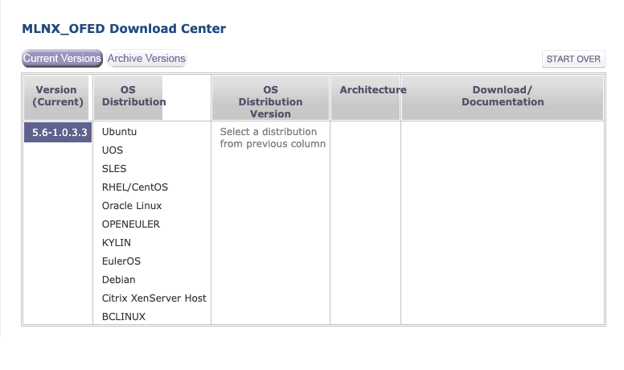

# 安装驱动

初次使用 `InfiniBand` 网卡，需要在 \[NVIDIA官网]\([https://network.nvidia.com/products/infiniband-drivers/linux/mlnx\_ofed/](https://network.nvidia.com/products/infiniband-drivers/linux/mlnx\_ofed/)) 下载网卡对应型号的驱动安装包，`InfiniBand` 型号网卡的官方驱动名称为 `MLNX_OFED` (\*需要注意的是，一些驱动包名称为`MLNX_EN` 型号的驱动包为非官方驱动，二者在部分功能上存在差异\*)。

`MLNX_OFED` 驱动包是经官方认证的驱动包，支持各个主流操作系统平台的安装包下载。包括 `RHEL` 、`Ubuntu`、`Debian`、`Oracle`等一系列操作系统的支持。


以下为使用 `ConnectX-3` 系列网卡安装驱动的步骤

#### 下载驱动

进入 \[驱动下载]\([https://network.nvidia.com/products/infiniband-drivers/linux/mlnx\_ofed/](https://network.nvidia.com/products/infiniband-drivers/linux/mlnx\_ofed/)) 页面(如下图)，下载安装包提供了两种途径，分别为 `Current Versions`、`Archive Versions`。如需要下载历史版本的驱动包，可选择 `Archive Versions` 通道选择合适版本进行下载。                                      &#x20;



根据对应的驱动版本选择操作系统类型、操作系统版本、系统架构，可以获取到驱动包的下载路径。下载的驱动包分为 **iso**、**tgz**、**\*SRC-\*.tgz。**

.png>)

下载驱动包，驱动安装包上传到服务器的 `/tmp` 目录下，计算驱动安装包的校验和(_防止因为网络原因出现安装包不一致_)

```bash
#sha256sum /tmp/MLNX_OFED_LINUX-5.0-1.0.0.0-rhel7.8-x86_64.tg
907e241c9b6b84ffaaad3defd350f630b5f62d542011b27ddabd6dc6e7d52374  /tmp/MLNX_OFED_LINUX-5.0-1.0.0.0-rhel7.8-x86_64.tgz
```

#### 安装驱动

安装网卡驱动时需要根据下载的安装介质的方式进行安装，不同的安装介质对应不同的安装方式。


**tgz方式安装**

**tgz** 方式安装驱动包是使用最广泛的一种驱动安装方式。相比其他方式安装来说更加简单，高效。

* 解压驱动包

```bash
#tar -xzf /tmp/MLNX_OFED_LINUX-5.0-1.0.0.0-rhel7.8-x86_64.tgz -C /tmp/
```

* 安装驱动

这里只考虑安装驱动的情况，如需要安装 firmware 可添加 `--force-fw-update` 参数

‼️ 安装驱动过程中需要在联网环境下进行，避免因为包依赖安装失败导致驱动安装失败

```bash
#./mlnxofedinstall --add-kernel-support --force
```

* 重启驱动

安装驱动结束后，需要重启驱动。可通过重启操作系统或重启网卡服务使驱动生效。

1. 重启操作系统
2. 重启网卡服务

```bash
#/etc/init.d/openibd restart
```


**iso 方式安装**

除 **tgz** 方式的安装包外，官方的驱动包还提供了 **iso** 形式的安装包。具体安装方式如下

* 下载iso驱动安装镜像
* 挂载iso镜像

```bash
#mount -o ro,loop MLNX_OFED_LINUX-5.0-1.0.0.0-rhel7.8-x86_64.iso /mnt
```

* 执行安装程序

```bash
#/mnt/mlnxofedinstall --force
Logs dir: /tmp/MLNX_OFED_LINUX-x.x-x.logs
This program will install the MLNX_OFED_LINUX package on your machine.
Note that all other Mellanox, OEM, OFED, RDMA or Distribution IB packages will be removed.
Those packages are removed due to conflicts with MLNX_OFED_LINUX, do not reinstall them.
Starting MLNX_OFED_LINUX-x.x.x installation ...
........
........
Installation finished successfully.
Attempting to perform Firmware update...
Querying Mellanox devices firmware ...
```

* 重启操作系统/驱动

```bash
#/etc/init.d/openibd restart
```

重启驱动的过程中可能会因为某些模块被加载而无法重启驱动，可使用 modprobe -r \<driver> 进行卸载后重新重启驱动服务。


#### 查看驱动版本

驱动安装成功且重启后，可使用 ofed\_info -s 查看驱动版本。

```bash
#ofed_info -s
OFED-internal-5.0-1.0.0.0:
```


#### 卸载驱动

卸载驱动执行方式 `ofed_uninstall.sh` 。

```bash
#ofed_uninstall.sh
```
